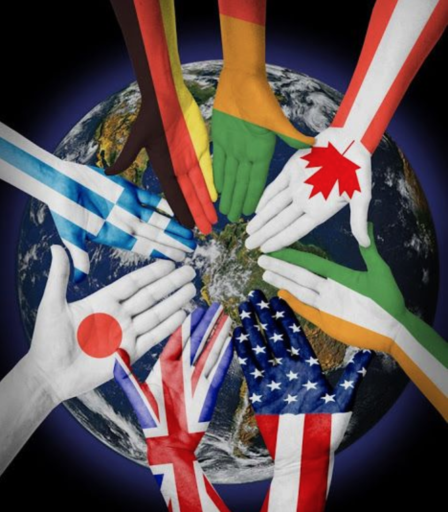

<h1 align="center">
  
</h1>

# MATCH THE FLAG

## Table of Contents

* [Why building a flag game?](#why-building-a-flag-game)
* [How the game work?](#how-the-game-work)
* [UX](#ux)
    * [Strategy: Why and what?](#why-and-what)
        * [1. Primary target audience](#1-primary-target-audience)
        * [2. Who is the project for?](#2-who-is-the-project-for)
        * [3. What is culturally appropriate?](#3-what-is-culturally-appropriate)
        * [4. What content would be relevant?](#4-what-content-is-relevant)
        * [5. Why is this so special?](#5-why-is-this-so-special)
    * [Scope: User Stories](#user-stories)
    * [Structure: Features](#features)
        * [1.Existing Features](#1-existing-features)
        * [2.Features Left to Implement](#2-features-left-to-implement)
    * [Skeleton: Wireframes](#wireframes)
    * [Surface: Design](#design)
        * [1. Color Scheme](#1-color-scheme)
        * [2. Font](#2-font)
        * [3. Logo](#3-logo)
* [Testing](#testing)
* [Technology Used](#technology-used)    
* [Deployment](#deployment)
* [Credits](#credits)
    * [Special Thanks & Acknowledgements](#special-thanks--acknowledgements)

## Why building a flag game?
For the second milestone project, I decided to make an interactive and educational game, so I could use Javascript functional programming which I have just learnt.

I like games as I believe anything can be learnt while having fun. Although I have not been playing a lot of online games or game apps myself, I am now a mum and often look for interesting, educative and well designed numeric games for my children.

My oldest son loves the planet, its continents, countries, and its flags, while he dreams of travelling when he stares at his globe.
I, myself, am passionate about discovering other cultures, learning and understanding languages and travelling generally in various countries while getting to know its people.
I remember as a child, one of the online game I played over and over again was a plane flying over the world map. The plane had a label behind with a country name written. The game was to click on the country on the map shown by the plane.

# How the game work
So I decided on making a game where the player would have to recognise a flag and match it to a country while random information would be showing about the country as a learning gift to the user.
For this, I would need to use two main APIs, one to display the flag and one to display random facts about the country once the match is successful.

The design of the game should be simple enough for a child to use it and attractive for an adult to play without much distractions and making them want to play more, to learn more...

More details about the design and structure of the game:
1. common mode, by flag (easy level): display a flag and match it to a country among 4 options
2. reversed mode, by country (easy level): display a country and match it to a flag among 4 options

[Back to Top](#table-of-contents) 

# UX
## Why and what
### 1. Primary target audience
For anyone from 6years old interested by geography or want to learn for specific purpose
- *Strategy*
    - Make the game interactive, fun and educative with a very simple design --- catchy and compelling
    - Minimal content and large images with minimal number of steps to start playing, match the flag, get results and continue or stop

### 2. Who is the project for
As shown in my intro, game is for anyone looking to test their knowledge of geography and flags.
The objective is also to trigger anyone else to learn more about other countries and cultures via an unknown flag
1.
- *strategy* 
    - To make the game easy enough for anyone to build their knowledge of flags and countries while playing. 
    - Dont want to make anyone give up after one trial and dont want knowledgeables players to get bored
    - Have an easy mode with 2 attempts for each flag where player is allowed to fail before trying another flag.
    - 20 random flags in one game
    - Player build points and at the end of the game, get a result which can be improved > motivation to try again to get a better score

In the future, to build difficult mode/level, also called "map mode" or "extreme (so good players are not bored): display Google Map in background, flag displayed, player has to click on map to show correct matching country

### 3. What is culturally appropriate
Appropriate for 6years old minimum and user-friendly for their age and dextirity
- *strategy* 
    - Make sure random fact are relevant for kids and do not contain inappropriate content
    - Each button is not too small
    - Font size big enough for a child of 6years old who is learning to read

### 4. What content would be relevant
Flags and countries of the world (not fake, not regions or small ethnies) - appropriate random fact for kids
- *strategy* 
    - Study the flag API and see if only real countries flag are in there, also maybe see if possible to remove the most known flags to make the game already up from basic level (ex: US, UK, France...)
    - Study random fact API and see if all content is appropriate - if needed I will make up one API myself with random fact more relevant to kids

### 5. Why is this so special
Hard to find simple games which are also educational for kids and adults on desktop or browser (not app). Most online games have poor or too complex design with a lot of content
- *strategy* 
    - Catchy and compelling website, with brief but effective content.

During my research in planning and designing the website, I asked a few questions to some friends who could be potential clients and also the practitioner himself. From those questions and my own research of other websites and practice, came the user stories below.
Before the user stories, I wanted to add here a few questions asked and their answers.

1. What does the User expect?
	* I expect a simple game which is easy enough to get into it, with pastel colors and very minimal content. After a few games, I want to find a difficult level where I can continue to be challenged
2. How can a game be interesting enough so I want to keep playing?
	* With different modes and levels, where I can see my score so I am motivated to improve it. A game where I dont get bored and I can learn from it.

[Back to Top](#table-of-contents) 

## User Stories

During the scope plane and while establishing the user stories for each page and making wireframes, the following features were decided.
This helped me to plan ahead and also to work through specific sprints to implement one feature at a time, answering one user story at a time...
### As a general user, I am expecting:
* A game to learn about world flags and countries
* Something fun to challenge my geography knowledge
* A game where I can also learn extra information about places and cultures
* A quick and mobile friendly game to play anywhere from a phone
* A game with a clear structure where I dont need to think to find how to play
* A game where the instructions and questions are easy to understand
* A game with a simple design so I can focus on the game itself and easily see the colors of the flags
* A game with no bright colors so my eyes are restarted
* To see my scores at the end of each game so I can try to improve
* To continue being challenged by more than one mode

### As a user aged between 6 and 10 years old, I a expecting:
* Have fun while learning
* Not too much reading so it is more fun than educative
* When I have to read, big enough text so reading is part of the fun
* Buttons big enough to click easily

### As a parent of child player, I am expecting:
* Content of the game to be appropriate to my child
* Game to be easy enough so my child continues to play and learn
* Score shown with a short of encouragement
* Gift of learning about other cultures so my child grows aware of the world

### As a developer, I want:
* To build a game fun and interesting enough for lots of users
* To display my acquired knowledge of Javascript in my portfolio
* To have fun coding Javascript while building a fun game

[Back to Top](#table-of-contents) 

## Features
### 1. Existing Features:
* Feature 1 - Logo on the top left linking to home container at any moment which would reload the whole page and act also as quitting any ongoing game
* Feature 2 - Catching phrase for the user displayed on the home container in the top fixed banner
* Feature 3 - Home container displaying the instructions where user can click the mode they want to play. Loading or reloading the page would always display this container first.
* Feature 4 - Two buttons displayed below the instructions on the home container used to choose mode to play. Game wont start until a mode is chosen
* Feature 5 - Each above button triggers a separate hidden container to show while the home container becomes hidden
* Feature 6 - A flag container to play the mode where a flag is displayed and the user needs to choose between 4 country names
* Feature 7 - A country container to play the mode where a country name is displayed and the user needs to choose between 4 flags
* Feature 8 - Once one of the above container is displayed, 2 buttons appears in the nav banner replacing catching phrase
* Feature 9 - Restart button to restart a game in the current mode chosen
* Feature 10 - Modes button to take user back to home container to choose another mode
* Feature 11 - on each game container, 4 clickable answers to choose from. One display the country names, the other display the flags
* Feature 12 - Question count displayed on top of the game container throughout any game played and showing which question is displayed out of the maximum 20
* Feature 13 - Score count displayed on top of the game container and incremented throughout any game played. Score increments depending of the verified match javascript functional
* Feature 14 - Sweet Alert fires after a match is verified. Alert disappear after a timer of 2sec, set alert so user cannot click outside, escape the pop up or click ok.
* Feature 15 - An encouraging message with a success icon is displayed if match is correct. 
* Feature 16 - A failed message with a cross as icon is displayed if match is incorrect. 
    - On the flag game, the name of the country associated with flag is displayed on the alert to help user to improve for a future game
    - On the country game, the name of the country associated with each answer item, is displayed on the alert when clicked and match incorrect
* Feature 17 - A game over container will be shown after the maximum questions have been played
* Feature 18 - A different message will appear depending of the score:
    - Up to and including 10: "Got there!...definitely can do better! Dare to try again and improve this score?"
    - Between 11 and 14: "WOW very impressive! With more practice, you can beat this great score!"
    - Between 15 and 19: "Bravooooo you are super smart! Reach the 20/20 or wait for the extreme mode to be built...?"
    - 20: "Amazing you beat the game! Now I really have to build the extreme mode asap..."
* Feature 20 - Buttons to restart a game in same mode or choose a different mode displayed below the message of game over container

### 2. Features Left to Implement:
* Original idea was to show a unique fact of each country once matched but realised that no api existed already which means I would need to build a local json file with a unique fact for 250 countries -- Unfortunately, did not have time to do this but will in the future
* Matching mode (medium level): display 3 very similar flags and 3 countries and ask player to match flag with correct country (ex: Ireland, India, Ivory Coast flags or Indonesia and Poland)
* Map mode (difficult level): display Google Map in background, flag displayed, player has to click on map to show correct matching country

[Back to Top](#table-of-contents) 

## Wireframes

I used Balsamiq tool for the wireframes and attached them to the directory in assets. 
I spent a considerable amount of time doing wireframes in details as I had no clue of design before and wanted to have a clear idea of how the website looked like.

- [Welcome page on desktop](https://raw.githubusercontent.com/mkuti/FlagGame_milestone_2/master/wireframes/Desktop-welcome-page.png)
- [Desktop game page](https://raw.githubusercontent.com/mkuti/FlagGame_milestone_2/master/wireframes/Desktop-choose-country.png)
- [Mobile Home page](https://raw.githubusercontent.com/mkuti/FlagGame_milestone_2/master/wireframes/Mobile-welcome-page.png)
- [Mobile game page](https://raw.githubusercontent.com/mkuti/FlagGame_milestone_2/master/wireframes/Mobile-choose-country.png)

As always when implementing coding, these wireframes templates do not exactly reflect the final version of the website itself but they were very useful for me to have an approximate design in my head.
The color theme changed completely after implementing design in the code. I removed lots of features due to lack of time and expertise, such as the map in the background which was supposed to be for one extreme game mode.

[Back to Top](#table-of-contents) 

## Design
### 1. Color scheme
As I am not good at putting colors together and with design generally, I always try to create wireframes that include colors. It helps me to imagine the design before I start coding. 
When coding, I am focused on writing the code without getting too distracted by the design.
The game had a dark red and blue thematic when I designed it on the wireframes to avoid too much brightness on the screen while playing. I did not have any explanation about the color red itself.
During a meeting with my mentor, he advised that the color theme was maybe too dark which did not go too well with the colorful flags. (commit e04e2a6).
I then tried to make it a little brighter color, replaced red by a green as I find it easier on the eyes, and is my favourite color as representing the nature, so can be a very blending background to colorful flags. (commit d112cad)
I then showed the game to a friend as like me, she did not like the white background as too bright and not eyes friendly. 
I then changed the body background-colour to match the light-green which then removed the center box and I ended up setting the border to none.
The color is not too bright for the eyes, does not disturb the colors of any flags displayed, giving a sense of warm and calming atmosphere to the game.

### 2. Font
I chose the font [Kalam](https://fonts.googleapis.com/css?family=Kalam:300,400,700'), with the idea of finding a font that is catchy enough without again disturbing the user while he plays. 
As the game was built also for kids learning to read, the font should be pretty standard without any different twists. Kalam has this interesting way of being young and modern while also having the standard curves of letters.
Chose to have most button and words written in uppercase so again kids could read them faster and dont get bothered by the element of reading.

### 2. Logo
I wanted to have a logo containing flags, showing their colors, their uniqueness. Because the original idea was to incorporate a map in the game, I originally found an image of a map of the world with a flag on each country.
But because the background of that image was white, it did not fit with the rest of the color scheme and I chose another image.
I found the other image on Pinterest and downloaded as well as took a screenshot. (https://www.pinterest.com/pin/271060471299685564/). I then used [TinyJPG](https://tinyjpg.com/) to compress and reduce the size of the image before uploading it to GitPod for the game.
The final logo is an image of hands intermixed with some flags displayed on their palms and with the planet Earth displayed as background in a dark mode. 
It represents exactly the idea of the game, that playing to match a flag is discovering the world, understanding better other cultures and be Earth citizens all the same time.

[Back to Top](#table-of-contents) 

# Testing

## Final and official testing:
  * [W3 MarkUp validation](https://validator.w3.org)
  * [W3 CSS validation](https://jigsaw.w3.org/css-validator/)

I checked the validity of my code at different times and received few errors on HTML markup which I worked on correcting. I did not get any errors with my CSS.
Example of an error in the MarkUp corrected:
- *The frameborder attribute on the iframe element is obsolete. Use CSS instead.* I then removed frameborder from HTML and added border: none in CSS

## General testing:
As I did not have a lot of time and I was not really expert in Jasmine or any automating testing, I decided to do all the testing manually via the browser and Chrome Developer tools
My strategy is very simple: as soon as I write a line of code, I open the page in my browser to test it, make sure it works until I am fully happy with what I see and how it functions. 
For each feature I was working on, I tried to preview it in Chrome Dev tools to understand quickly which HTML or CSS would cause a certain effect and correct it as soon as possible. 
This allowed me to fully comprehend the languages and push to GitHub only after I made the whole feature was working well.
Once I was quite happy with the main features, I started to share the url with friends and family to get their first views and reactions on the design and the functionality of the game.
Through my own testing and with views of others, I have fixed a lot of design flaws and numerous bugs in my Javascript code. Thanks to that, I can present a website which is almost perfect :)

## Testing in different browsers:
I used Google Chrome as my primary browser and constantly tested it on my mobile phone also using the same browser. 
I also tested the game on Safari via an iMac with a very big screen and an iPod touch with probably the smallest screen regularly and never found any specific issue. 

## Specific testing scenarios:

### Color theme of the page
__Goal__: 
Found the perfect color theme that would attract players to stay on the page without creating too much distractions in the background of colorful flags
__Issue__: 

[Back to Top](#table-of-contents) 

# Technologies Used
- This website used HTML, CSS and Javascript programming languages.
- [GitPod](gitpod.io) - I used __AWS Cloud9__ as my IDE for the development of this website.
- [BootstrapCDN](https://www.bootstrapcdn.com/) - The website is using __Bootstrap4__ as the basic structure and grid of the website and to increase the responsiveness of the website.
- [FontAwesome](https://kit.fontawesome.com/f7e192f540.js) - The website is using __Font Awesome__ to display many icons on all pages
- [Google Fonts](https://fonts.google.com/)- The website uses __3 different Google fonts__ to style the content text and headings - Url imported in CSS
- [Youtube](https://www.youtube.com/embed/7QMdT02TVnQ) - The website used __YouTube__ to host the video for the "Qigong page".
- [jQuery](https://jquery.com/) and [Popper.js](https://popper.js.org/) - The website uses __jQuery__ and __Popper.js__ to bring in Javascript which makes the navbar responsive
- [AutoPrefixer](https://autoprefixer.github.io/) - I have used __AutoPrefixer__ to make sure the css code worked on all browsers
- [Pexels](https://www.pexels.com) - Website imported images from __Pexels__ for the full background image and all banners image
- [Tiny.jpg](https://tinyjpg.com) - I have used __Tinyjpg__ to compress all images of the website to increas the website loading on browser
- [ColorSpace](https://mycolor.space) - I have used __ColorSpace__ to find matching colors for the website
- [Balsamic](https://balsamiq.cloud) - I have used __Balsamic__ to build the wireframes which I then exported to the IDE
- [Favicon converter](https://favicon.io/favicon-converter/) - I used Favicon converter to convert the logo into a favicon which I was able to insert in the asset folder and I tested it to be working

# Media and Content origin
I used the following API for the project which contains a json object of 250 countries with among other data, contains the name of the country, its alphacode, and its flag: https://restcountries.eu/

#### Other Resources:
* https://upload.wikimedia.org/wikipedia/commons/8/87/Flag-map_of_the_world.svg - Previous logo image
* https://www.pinterest.com/pin/271060471299685564/ - New logo image
* http://nationfacts.net/
* https://www.worldatlas.com/
* https://12go.asia/en/cambodia/interesting-facts
* https://southbaybeachclub.com/20-fun-facts-about-the-cayman-islands/

# Deployment
I have been using the Integrated development environment (IDE) [GitPod]() to develop this milestone project.
After creating a new GitHub repository, I linked it on the terminal of my IDE. I could then commit any update of my code and push it to the remote repository so it could be regularly backed up and accessed by others.

To deploy the website from the GitHub repository to its published GitHub page, I followed the steps as below:

__Enabling GitHub Pages to publish site from master as a publishing source__
1. Navigate to GitHub Pages site's repository
2. Under repository name, clicked Settings
3. Used "Select source drop-down menu" to select master as my GitHub Pages publishing source
4. Clicked save

When I submitted this Milestone project, I confirmed that the Development Branch and Master Branch are identical.

__HOW TO RUN CODE LOCALLY__

1. On GitHub, navigate to the main page of the repository
2. Under the repository name, click Clone or download
3. In the Clone with HTTPs section, click to copy the clone URL for the repository
4. Open Terminal
5. Change the current working directory to the location where you want the cloned directory to be made
6. Type git clone, and then paste the URL you copied in Step 2 when git clone: https://github.com/YOUR-USERNAME/YOUR-REPOSITORY

7. Press Enter > Your local clone will be created.

### Credits

*

# Special thanks

-

__Thank you all!__

##### Disclaimer:
The content of the website is for educational purposes only.

[Back to Top](#table-of-contents) 